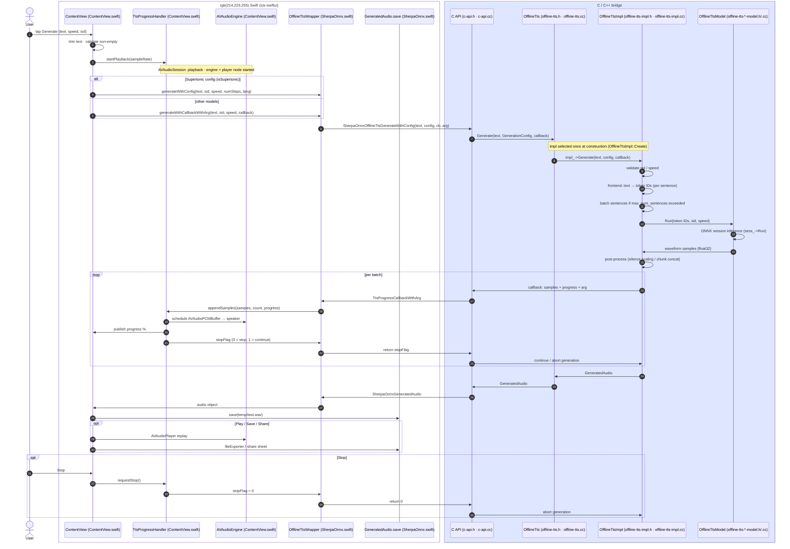

# Full audio generation flow

```mermaid
sequenceDiagram
  autonumber
  actor User
  box rgb(214,223,255) Swift (ios-swiftui)
    participant CV as ContentView (ContentView.swift)
    participant PH as TtsProgressHandler (ContentView.swift)
    participant ENG as AVAudioEngine (ContentView.swift)
    participant SW as OfflineTtsWrapper (SherpaOnnx.swift)
    participant WAV as GeneratedAudio.save (SherpaOnnx.swift)
  end
  box rgb(222,231,255) C / C++ bridge
    participant API as C API (c-api.h · c-api.cc)
    participant TTS as OfflineTts (offline-tts.h · offline-tts.cc)
    participant IMPL as OfflineTtsImpl (offline-tts-impl.h · offline-tts-impl.cc)
    participant MODEL as OfflineTtsModel (offline-tts-*-model.h/.cc)
  end

  User->>CV: tap Generate (text, speed, sid)
  CV->>CV: trim text · validate non-empty
  CV->>PH: startPlayback(sampleRate)
  Note over PH,ENG: AVAudioSession .playback · engine + player node started
  alt Supertonic config (isSupertonic)
    CV->>SW: generateWithConfig(text, sid, speed, numSteps, lang)
  else other models
    CV->>SW: generateWithCallbackWithArg(text, sid, speed, callback)
  end
  SW->>API: SherpaOnnxOfflineTtsGenerateWithConfig(text, config, cb, arg)
  API->>TTS: Generate(text, GenerationConfig, callback)
  Note over TTS,IMPL: impl selected once at construction (OfflineTtsImpl::Create)
  TTS->>IMPL: impl_->Generate(text, config, callback)
  IMPL->>IMPL: validate sid / speed
  IMPL->>IMPL: frontend: text → token IDs (per sentence)
  IMPL->>IMPL: batch sentences if max_num_sentences exceeded
  IMPL->>MODEL: Run(token IDs, sid, speed)
  MODEL->>MODEL: ONNX session inference (sess_->Run)
  MODEL->>IMPL: waveform samples (float32)
  IMPL->>IMPL: post-process (silence scaling / chunk concat)
  loop per batch
    IMPL->>API: callback: samples + progress + arg
    API->>SW: TtsProgressCallbackWithArg
    SW->>PH: appendSamples(samples, count, progress)
    PH->>ENG: schedule AVAudioPCMBuffer → speaker
    PH->>CV: publish progress %
    PH->>SW: stopFlag (0 = stop, 1 = continue)
    SW->>API: return stopFlag
    API->>IMPL: continue / abort generation
  end
  IMPL->>TTS: GeneratedAudio
  TTS->>API: GeneratedAudio
  API->>SW: SherpaOnnxGeneratedAudio
  SW->>CV: audio object
  CV->>WAV: save(temp/test.wav)
  opt Play / Save / Share
    CV->>ENG: AVAudioPlayer replay
    CV->>WAV: fileExporter / share sheet
  end
  opt Stop
    User->>CV: Stop
    CV->>PH: requestStop()
    PH->>SW: stopFlag = 0
    SW->>API: return 0
    API->>IMPL: abort generation
  end
    
```
