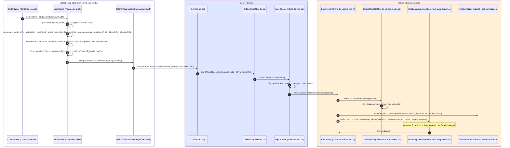

# Kokoro v1.0 config and model construction

```mermaid
sequenceDiagram
  autonumber
  box rgb(214,223,255) Swift config (ios-swiftui)
    participant CV as ContentView (ContentView.swift)
    participant VM as ViewModel (ViewModel.swift)
    participant SW as OfflineTtsWrapper (SherpaOnnx.swift)
  end
  box rgb(222,231,255) C / C++ bridge
    participant API as C API (c-api.cc)
    participant TTS as OfflineTts (offline-tts.cc)
    participant FACT as Impl::Create (offline-tts-impl.cc)
  end
  box rgb(255,240,215) Kokoro v1.0 construction
    participant KIMPL as KokoroImpl (offline-tts-kokoro-impl.h)
    participant KMD as KokoroModel (offline-tts-kokoro-model.cc)
    participant FE as MultiLangLexicon (kokoro-multi-lang-lexicon.cc)
    participant NORM as TextNormalizer (kaldifst · text-normalizer.h)
  end

  CV->>VM: createOfflineTts()  (ContentView.swift:184)
  VM->>VM: getTtsFor_kokoro_multi_lang_v1_0()  (ViewModel.swift)
  VM->>VM: resources: model.onnx · voices.bin · tokens.txt · lexicon-us-en.txt · lexicon-zh.txt · espeak-ng-data · number-zh.fst · date-zh.fst · phone-zh.fst
  VM->>VM: lexicon = lexicon-us-en.txt,lexicon-zh.txt · ruleFsts = date-zh.fst,phone-zh.fst,number-zh.fst
  VM->>VM: KokoroModelConfig → ModelConfig(kokoro:) → OfflineTtsConfig(model:ruleFsts:)
  VM->>SW: SherpaOnnxOfflineTtsWrapper(config: &config)
  SW->>API: SherpaOnnxCreateOfflineTts(config)  (SherpaOnnx.swift:1410)
  API->>TTS: new OfflineTts(config)  (c-api.cc:1619 · offline-tts.cc:254)
  TTS->>FACT: OfflineTtsImpl::Create(config)
  FACT->>FACT: config.model.kokoro.model not empty → KokoroImpl
  FACT->>KIMPL: make_unique OfflineTtsKokoroImpl(config)
  KIMPL->>KMD: OfflineTtsKokoroModel(config.model)
  KMD->>KMD: Ort::Session(model.onnx) · load voices.bin
  KIMPL->>NORM: load rule_fsts → TextNormalizer (date-zh.fst · phone-zh.fst · number-zh.fst)
  KIMPL->>FE: InitFrontend → KokoroMultiLangLexicon(tokens.txt · lexicon-us-en,lexicon-zh · espeak-ng-data)
  Note over FE: version ≥ 2 · lexicon or lang required · InitEspeak(data_dir)
  FE->>KIMPL: frontend ready
    
```
