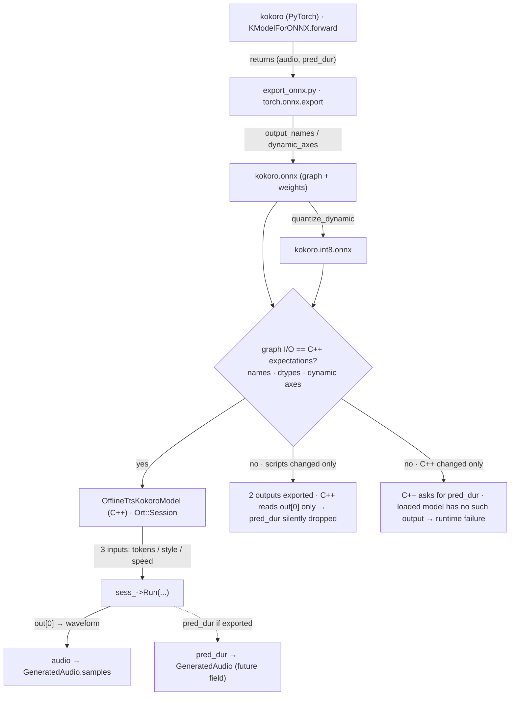
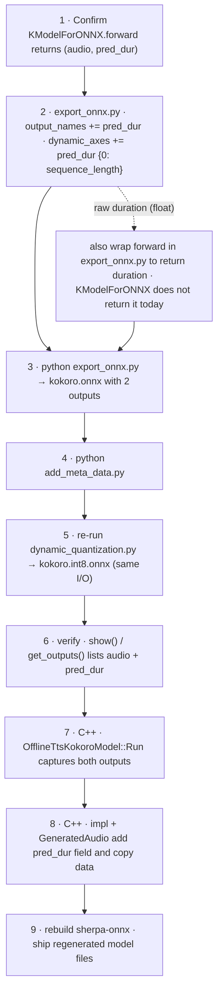

# Kokoro ↔ scripts/kokoro/v1.0 ↔ OfflineTtsKokoroModel: how the audio output is connected

## The four actors

| Actor | What it is | Where it lives |
|---|---|---|
| `kokoro` (Python package) | The model itself. `KModelForONNX.forward` wraps `KModel.forward_with_tokens`, which computes and returns `(audio, pred_dur)`. | hexgrad/kokoro (on this machine: editable install from `/Users/a1234/Projects/kokoro`) |
| `scripts/kokoro/v1.0` | sherpa-onnx's export pipeline for Kokoro v1.0: traces `KModelForONNX` into `kokoro.onnx` (`export_onnx.py`), adds runtime metadata (`add_meta_data.py`), produces `kokoro.int8.onnx` (`dynamic_quantization.py`), and generates `tokens.txt`, lexicons, `voices.bin`. | `sherpa-onnx-learning/scripts/kokoro/v1.0` |
| `OfflineTtsKokoroModel` | C++ runtime wrapper around the ONNX file: loads `kokoro.onnx` into an `Ort::Session`, prepares the three input tensors, calls `sess_->Run(...)`, and returns the first output tensor. | `sherpa-onnx/csrc/offline-tts-kokoro-model.cc` |
| output of `sess_->Run(...)` | The ONNX graph's output tensors — whatever the exported model actually produces (names, dtypes, shapes, dynamic axes). | determined by the `.onnx`/`.int8.onnx` file, not by C++ |

## The relation is a contract chain



The coupling point between the Python side and the C++ side is the **ONNX I/O signature**: the exported graph must expose exactly the inputs and outputs `OfflineTtsKokoroModel` expects — same names, dtypes, and dynamic axes. If either side changes without the other, the runtime silently ignores the extra output or fails to find the expected tensor.

## The contract in detail

| | Name | Type | Shape |
|---|---|---|---|
| input | `tokens` | `int64` | `[1, sequence_length]` |
| input | `style` | `float` | `[1, 256]` |
| input | `speed` | `float` | `[1]` |
| output | `audio` | `float` | `[audio_length]` |
| output (optional) | `pred_dur` | `int64` | `[sequence_length]` |

- Declared in `export_onnx.py` via `input_names`, `output_names`, `dynamic_axes`.
- Visible as `NodeArg`s in `dynamic_quantization.py` (`sess.get_inputs()` / `sess.get_outputs()`), which is also why the int8 model must be re-exported after any change.
- Consumed in C++ via `GetInputNames`/`GetOutputNames`, building exactly three inputs, then `sess_->Run(...)` and `out[0]` as the waveform.

## Why the scripts and the C++ must change together

The honest sequence is: **model computes it → export names it → int8 re-exported → C++ consumes it**.

Using `pred_dur` as the example:

1. `KModelForONNX.forward` already returns `(waveform, duration)` — the model computes it.
2. `export_onnx.py` must add `"pred_dur"` to `output_names` (and its dynamic axis) so the graph actually emits it.
3. `dynamic_quantization.py` must be re-run so `kokoro.int8.onnx` carries the same outputs.
4. `OfflineTtsKokoroModel::Run` must capture both outputs from `sess_->Run`, and the impl must copy `pred_dur` into `GeneratedAudio`.

Changing only one side breaks the contract:

- Only the scripts changed → the graph has two outputs, but C++ still reads only `out[0]`; `pred_dur` is silently dropped.
- Only the C++ changed → `Run` asks for `pred_dur`, but the loaded model doesn't output it, so the session has no such output to read.

## How to verify the contract

- `test.show("kokoro.onnx")` (or `dynamic_quantization.show()`) prints every input/output `NodeArg` of the deployed file. After the `pred_dur` change it must list both:
  ```
  NodeArg(name='audio', type='tensor(float)', shape=['audio_length'])
  NodeArg(name='pred_dur', type='tensor(int64)', shape=['sequence_length'])
  ```
- `onnxruntime.InferenceSession(path).get_outputs()` returns the same list programmatically.
- In C++, `GetOutputNames(sess_.get(), ...)` returns the same names the runtime will request.
- **Caveat — the list check is not the whole story.** `test.py`'s end-to-end run (`OnnxModel.__call__`) only requests `get_outputs()[0].name`, so it generates the WAV from `audio` and never reads `pred_dur`. To verify `pred_dur` as actual data (shape/dtype/values), extend the run call to request all outputs:
  ```python
  names = [o.name for o in self.model.get_outputs()]
  results = self.model.run(names, { ...tokens / style / speed... })
  audio, pred_dur = results[0], results[1]
  print(pred_dur.shape, pred_dur.dtype)
  ```
- Running `test.py` requires `onnxruntime`, `soundfile`, `jieba`, and `piper_phonemize` (custom wheel: `pip install piper_phonemize -f https://k2-fsa.github.io/icefall/piper_phonemize.html`).

## Exposing `pred_dur` or raw `duration` (step by step)



For `pred_dur` (already computed by the model):

1. Confirm the installed `kokoro` package's `KModelForONNX.forward` returns `(audio, pred_dur)`.
2. In `scripts/kokoro/v1.0/export_onnx.py`, add `"pred_dur"` to `output_names` and `"pred_dur": {0: "sequence_length"}` to `dynamic_axes`.
3. Re-run `python3 export_onnx.py` → `kokoro.onnx` now has two outputs.
4. Re-run `python3 add_meta_data.py` so the metadata is applied to the regenerated file.
5. Re-run `python3 dynamic_quantization.py` → `kokoro.int8.onnx` keeps the same I/O.
6. Verify: `test.show("kokoro.onnx")` / `sess.get_outputs()` now lists `audio` and `pred_dur` — see "How to verify the contract" for the caveat that `test.py`'s inference path only reads `output[0]`, so it checks the graph's output list but not `pred_dur` values.
7. C++ `OfflineTtsKokoroModel::Run`: capture both outputs from `sess_->Run(...)` and return them (e.g., an `{audio, pred_dur}` result struct) instead of `out[0]` only.
8. C++ `OfflineTtsKokoroImpl::Process` + `GeneratedAudio`: add a `pred_dur` field (e.g., `std::vector<int64_t>`) and copy the tensor data into it.
9. Rebuild sherpa-onnx and ship the regenerated model files with the app.

For the raw float `duration` (pre-rounding), step 2 additionally requires changing the model wrapper: `KModelForONNX.forward` (or `forward_with_tokens`) must return `duration` too — patch the local editable clone at `/Users/a1234/Projects/kokoro` or wrap it in `export_onnx.py` — then repeat steps 3–9.
