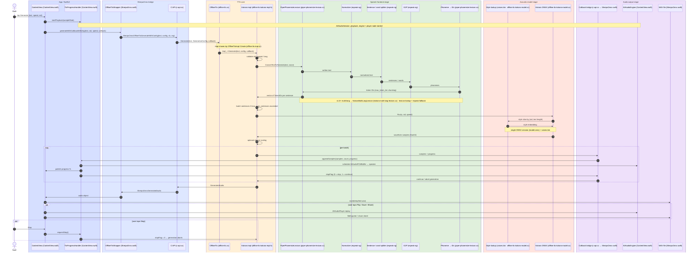

# Kokoro TTS call flow

```mermaid
sequenceDiagram
  autonumber
  actor User
  box rgb(214,223,255) App / SwiftUI
    participant CV as ContentView (ContentView.swift)
    participant PH as TtsProgressHandler (ContentView.swift)
  end
  box rgb(222,231,255) SherpaOnnx bridge
    participant SW as OfflineTtsWrapper (SherpaOnnx.swift)
    participant API as C API (c-api.cc)
  end
  box rgb(255,240,215) TTS core
    participant CORE as OfflineTts (offline-tts.cc)
    participant KOK as Kokoro impl (offline-tts-kokoro-impl.h)
  end
  box rgb(224,240,220) Speech frontend stage
    participant FE as PiperPhonemizeLexicon (piper-phonemize-lexicon.cc)
    participant NORM as Normalizer (espeak-ng)
    participant SPLIT as Sentence / word splitter (espeak-ng)
    participant G2P as G2P (espeak-ng)
    participant P2T as Phoneme → IDs (piper-phonemize-lexicon.cc)
  end
  box rgb(255,228,222) Acoustic model stage
    participant STY as Style lookup (voices.bin · offline-tts-kokoro-model.cc)
    participant KMD as Kokoro ONNX (offline-tts-kokoro-model.cc)
  end
  box rgb(238,224,250) Audio output stage
    participant CB as Callback bridge (c-api.cc → SherpaOnnx.swift)
    participant ENG as AVAudioEngine (ContentView.swift)
    participant WAV as WAV file (SherpaOnnx.swift)
  end

  User->>CV: tap Generate (text, speed, sid)
  CV->>PH: startPlayback(sampleRate)
  Note over PH,ENG: AVAudioSession .playback, engine + player node started
  CV->>SW: generateWithCallbackWithArg(text, sid, speed, callback)
  SW->>API: SherpaOnnxOfflineTtsGenerateWithConfig(text, config, cb, arg)
  API->>CORE: Generate(text, GenerationConfig, callback)
  Note over CORE,KOK: impl chosen by OfflineTtsImpl::Create (offline-tts-impl.cc)
  CORE->>KOK: impl_->Generate(text, config, callback)
  KOK->>KOK: validate sid / speed / lang
  KOK->>FE: ConvertTextToTokenIds(text, voice)
  FE->>NORM: written text
  NORM->>SPLIT: normalized text
  SPLIT->>G2P: sentences / words
  G2P->>P2T: phonemes
  P2T->>FE: token IDs (max_token_len chunking)
  FE->>KOK: vector of TokenIDs per sentence
  Note over FE,P2T: v1.0+ multi-lang → KokoroMultiLangLexicon (kokoro-multi-lang-lexicon.cc) · lexicon lookup + espeak fallback
  KOK->>KOK: batch sentences if max_num_sentences exceeded
  KOK->>KMD: Run(x, sid, speed)
  KMD->>STY: style slice by (sid, text length)
  STY->>KMD: style embedding
  Note over STY,KMD: single ONNX session (model.onnx) + voices.bin
  KMD->>KOK: waveform samples (float32)
  KOK->>KOK: optional silence scaling
  loop per batch
    KOK->>CB: samples + progress
    CB->>PH: appendSamples(samples, count, progress)
    PH->>ENG: schedule AVAudioPCMBuffer → speaker
    PH->>CV: publish progress %
    PH->>CB: stopFlag (0 = stop, 1 = continue)
    CB->>KOK: continue / abort generation
  end
  KOK->>API: GeneratedAudio
  API->>SW: SherpaOnnxGeneratedAudio
  SW->>CV: audio object
  CV->>WAV: save(temp/test.wav)
  opt user taps Play / Save / Share
    CV->>ENG: AVAudioPlayer replay
    CV->>WAV: fileExporter / share sheet
  end
  opt user taps Stop
    User->>CV: Stop
    CV->>PH: requestStop()
    PH->>KOK: stopFlag = 0 → generation aborts
  end
    
```
