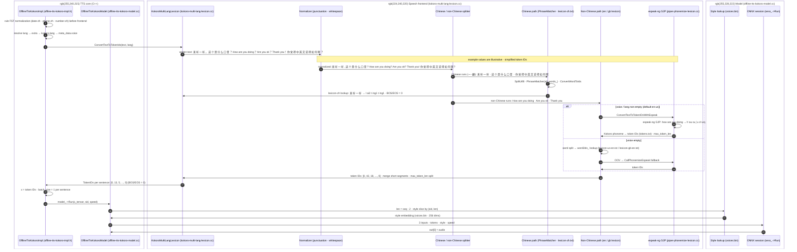

# Kokoro v1.0 speech frontend stage

Scope: from `frontend_->ConvertTextToTokenIds(...)` inside `OfflineTtsKokoroImpl::Generate` to `OfflineTtsKokoroModel::Run` (the first ONNX inference call).

## Call chain and files

| Step | Where | File |
|---|---|---|
| Entry | `OfflineTtsKokoroImpl::Generate` calls `frontend_->ConvertTextToTokenIds(text, lang)` | `sherpa-onnx/csrc/offline-tts-kokoro-impl.h` |
| Frontend (v1.0, version ≥ 2) | `KokoroMultiLangLexicon::ConvertTextToTokenIds` | `sherpa-onnx/csrc/kokoro-multi-lang-lexicon.cc` |
| espeak-ng helpers | `CallPhonemizeEspeak`, `ConvertTextToTokenIdsKokoroOrKitten`, `PiperPhonemesToIdsKokoroOrKitten` | `sherpa-onnx/csrc/piper-phonemize-lexicon.cc` |
| Model entry | `OfflineTtsKokoroModel::Run(x, sid, speed)` → `sess_->Run(...)` | `sherpa-onnx/csrc/offline-tts-kokoro-model.cc` |

## Sequence diagram

## Step by step

1. **Entry** — `OfflineTtsKokoroImpl::Generate` resolves `lang` (`gen_config.extra["lang"]` → `config_.model.kokoro.lang` → `meta_data.voice`, which is `en-us` for the exported v1.0 model) and calls `frontend_->ConvertTextToTokenIds(text, lang)`.
2. **Context before the call — FST normalization** — if rule FSTs are configured (`date-zh.fst`, `phone-zh.fst`, `number-zh.fst`), `Generate` runs each of them in order via `kaldifst::TextNormalizer::Normalize` before the frontend. The normalizer converts the input string into a linear FST, composes it with the rule FST (`fst::Compose`), takes the best path (`fst::ShortestPath`), and writes back the output labels (dropping zero-padding bytes). The rule FSTs are string-rewriting transducers: `number-zh.fst` expands digits to their spoken Chinese reading (illustrative: `123` → `一百二十三`), `date-zh.fst` expands dates (illustrative: `2026年8月13日` → `二零二六年八月十三日`), and `phone-zh.fst` handles phone numbers. Anything a rule does not cover passes through unchanged — which is why the two example texts below, containing no digits, dates, or phone numbers, are unchanged by this step.
3. **Punctuation normalization** — `ConvertTextToTokenIds` maps full-width/Chinese punctuation (，、；：。？！) to ASCII and merges whitespace runs.
4. **Language routing** — the text is split into Chinese runs (`[一-龥]+`) and non-Chinese runs.
5. **Chinese path** — `ConvertChineseToTokenIDs` first splits the run into one UTF-8 character per element via `SplitUtf8`. For `中國人民不信邪也不怕邪` that yields `["中", "國", "人", "民", "不", "信", "邪", "也", "不", "怕", "邪"]`. It then runs `PhraseMatcher(&all_words_, words, ...)` (max search length 10), which greedily groups adjacent characters into the **longest** lexicon phrase found, falling back to a single character when nothing matches. If `lexicon-zh.txt` contains `中國人民`, `不信邪`, and `不怕邪`, the grouping is `"中國人民" → "不信邪" → "也" → "不怕邪"`. Each grouped phrase then resolves via `ConvertWordToIds` against `word2ids_` (populated from `lexicon-zh.txt`); unmatched characters are skipped as OOV.
6. **Non-Chinese path** — `ConvertNonChineseToTokenIDs`:
   - voice non-empty (shipped default `en-us`) → `ConvertTextToTokenIDsWithEspeak`, which calls `ConvertTextToTokenIdsKokoroOrKitten` (espeak-ng phonemize → Kokoro phoneme → token IDs, chunked by `max_token_len`);
   - voice empty → word-split and look up `word2ids_` (`lexicon-us-en.txt` / `lexicon-gb-en.txt`), with per-word `CallPhonemizeEspeak` fallback for OOV.
7. **Sentence packing** — every segment gets BOS/EOS zeros (`0`), short segments are merged, and anything exceeding `max_token_len` is split.
8. **Back in `Generate`** — the `vector<TokenIDs>` becomes `x`; note `max_num_sentences != 1` is ignored for Kokoro, so **one sentence per batch**.
9. **Tensor prep** — `Process` flattens one sentence into `x_tensor` of shape `[1, seq]` and calls `model_->Run(x_tensor, sid, speed)`.
10. **`OfflineTtsKokoroModel::Run`** — reads `len = seq - 2` (the BOS/EOS zeros), slices the style embedding from `voices.bin` at `styles_[sid * dim0 * dim1 + len * dim1]` (shape `[1, 256]`), applies `speed` (falling back to `length_scale`), feeds the three inputs (`tokens`, `style`, `speed`), and `sess_->Run(...)` returns `out[0]` as the audio tensor.

## Data inputs used by this stage

| Data | Used for |
|---|---|
| `lexicon-zh.txt` | Chinese phrase/character → phoneme lookup (`word2ids_`) |
| `lexicon-us-en.txt`, `lexicon-gb-en.txt` | English word → phoneme lookup, only when voice is empty |
| `espeak-ng-data` | espeak-ng G2P (non-Chinese default, and OOV fallback) |
| `tokens.txt` | phoneme/symbol → numeric token ID |
| `voices.bin` | style embedding slice inside `OfflineTtsKokoroModel::Run` |

## Worked examples (CN / EN) after each step

All phoneme and token-ID values below are illustrative (simplified); the real outputs come from `lexicon-zh.txt`, espeak-ng, and `tokens.txt`.

| Step | CN example | EN example |
|---|---|---|
| input (written text) | 中國人民不信邪也不怕邪，不惹事也不怕事，任何外國不要指望我們會拿自己的核心利益做交易，不要指望我們會吞下損害我國主權、安全、發展利益的苦果！ | The sky above the port was the color of television, tuned to a dead channel. |
| 2 · FST normalization | unchanged (no digits / dates / phone numbers) | unchanged |
| 3 · punctuation normalization | 中國人民不信邪也不怕邪,不惹事也不怕事,任何外國不要指望我們會拿自己的核心利益做交易,不要指望我們會吞下損害我國主權,安全,發展利益的苦果! | unchanged (already ASCII; whitespace runs merged) |
| 4 · language routing | Chinese runs: 中國人民不信邪也不怕邪 · 不惹事也不怕事 · 任何外國不要指望我們會拿自己的核心利益做交易 · 不要指望我們會吞下損害我國主權 · 安全 · 發展利益的苦果 (punctuation tokens go to the non-Chinese path) | one non-Chinese run: The sky above the port was the color of television, tuned to a dead channel. |
| 5 · Chinese path (lexicon-zh lookup) | run 中國人民不信邪也不怕邪 → SplitUtf8: 中 國 人 民 不 信 邪 也 不 怕 邪 → PhraseMatcher: 中國人民 · 不信邪 · 也 · 不怕邪 → 中國人民 → zh ong1 g uo2 r en2 m in2 · … | — |
| 6 · non-Chinese path (espeak-ng G2P) | — | the sky above the port was the color of television, tuned to a dead channel → ðə skˈaɪ əbˈʌv ðə pˈɔɹt wˈʌz ðə kˈʌlɚ əv tˈɛləvɪʒən, tjˈund tə ə dˈɛd tʃˈænəl |
| 7 · numeric token IDs | per sentence, BOS/EOS = 0 · e.g. `[0, 13, 5, …, 0]` | per sentence, BOS/EOS = 0 · e.g. `[0, 42, 18, …, 0]` |

## Chunk boundaries: can a word or phrase be split across sentences?

Whether a single word's (or Chinese phrase's) token IDs can straddle two sub-sentences depends on the path:

| Path | Can a word/phrase be split? | Why |
|---|---|---|
| Chinese grouped phrase (`ConvertChineseToTokenIDs`) | No | The flush check uses the whole phrase size (`this_sentence.size() + ids.size() > max_len - 2`), then the entire `ids` vector is inserted into one sentence. Either the whole phrase fits (after flushing), or the whole phrase starts the new sentence. |
| Non-Chinese word, voice-empty lexicon path (`ConvertNonChineseToTokenIDs`) | No | Same atomic pattern: `this_sentence.size() + ids.size() + 3 > max_len - 2` flushes first, then the whole word's IDs are inserted. The per-word espeak OOV branch builds the word's IDs first, then applies the same whole-vector check. |
| Non-Chinese run, espeak-ng path (default `en-us`) | **Yes, possible** | `PiperPhonemesToIdsKokoroOrKitten` chunks the flat phoneme stream **per phoneme** at `max_token_len`, with no word-boundary awareness: `if (current.size() > max_len - 1)` flushes before each phoneme, so the boundary can land inside a word — its leading phonemes end one chunk (with BOS/EOS `0`s) and its trailing phonemes start the next. |

Implications:

- In the Kokoro impl each `TokenIDs` entry is processed as its own batch (batch size 1), so an espeak-path word split across chunks is synthesized across two ONNX inferences.
- The outer merge loop in `ConvertTextToTokenIds` cannot repair this: it only stitches *whole* chunks into sentences (or pushes them as-is); it never re-splits or moves individual tokens.
- This matters if you plan to expose per-token alignment data (e.g., `pred_dur` per sentence): durations will correspond to chunk/sentence units, not necessarily to whole words, for espeak-path input.
