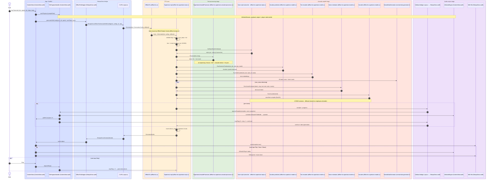

# Supertonic TTS call flow

```mermaid
sequenceDiagram
  autonumber
  actor User
  box rgb(214,223,255) App / SwiftUI
    participant CV as ContentView (ContentView.swift)
    participant PH as TtsProgressHandler (ContentView.swift)
  end
  box rgb(222,231,255) SherpaOnnx bridge
    participant SW as OfflineTtsWrapper (SherpaOnnx.swift)
    participant API as C API (c-api.cc)
  end
  box rgb(255,240,215) TTS core
    participant CORE as OfflineTts (offline-tts.cc)
    participant STC as Supertonic impl (offline-tts-supertonic-impl.cc)
  end
  box rgb(224,240,220) Text processing stage
    participant TXP as SupertonicUnicodeProcessor (offline-tts-supertonic-unicode-processor.cc)
  end
  box rgb(255,228,222) Acoustic model stage
    participant STY as Voice style (voice.bin · offline-tts-supertonic-impl.cc)
    participant DP as Duration predictor (offline-tts-supertonic-model.cc)
    participant TE as Text encoder (offline-tts-supertonic-model.cc)
    participant VE as Vector estimator (offline-tts-supertonic-model.cc)
    participant VCD as Vocoder (offline-tts-supertonic-model.cc)
    participant GEN as NormalDataGenerator (normal-data-generator.h)
  end
  box rgb(238,224,250) Audio output stage
    participant CB as Callback bridge (c-api.cc → SherpaOnnx.swift)
    participant ENG as AVAudioEngine (ContentView.swift)
    participant WAV as WAV file (SherpaOnnx.swift)
  end

  User->>CV: tap Generate (text, speed, sid, steps, lang)
  CV->>PH: startPlayback(sampleRate)
  Note over PH,ENG: AVAudioSession .playback, engine + player node started
  CV->>SW: generateWithConfig(text, sid, speed, numSteps, lang)
  SW->>API: SherpaOnnxOfflineTtsGenerateWithConfig(text, config, cb, arg)
  API->>CORE: Generate(text, GenerationConfig, callback)
  Note over CORE,STC: impl chosen by OfflineTtsImpl::Create (offline-tts-impl.cc)
  CORE->>STC: impl_->Generate(text, config, callback)
  STC->>STC: validate lang / speed / num_steps / sid
  STC->>STC: trim + chunk text (max_len 120/300)
  STC->>STY: GetStyleSliceForSid(sid)
  STY->>STC: style_dp + style_ttl (voice.bin)
  STC->>TXP: Process(text, lang)
  TXP->>STC: token IDs + text mask
  Note over TXP: no espeak-ng / lexicon / G2P · Unicode indexer + tts.json
  STC->>DP: RunDurationPredictor(text_ids, style_dp, mask)
  DP->>STC: duration (speed-adjusted)
  STC->>TE: RunTextEncoder(text_ids, style_ttl, mask)
  TE->>STC: text embeddings
  STC->>GEN: fill latent noise + latent mask
  loop num_steps denoising
    STC->>VE: RunVectorEstimator(latent, step, text emb, style, masks)
    VE->>STC: denoised latent
  end
  STC->>VCD: RunVocoder(latent)
  VCD->>STC: waveform samples (float32)
  Note over STY,VCD: 4 ONNX sessions · diffusion-based (no single-pass decoder)
  loop per chunk
    STC->>CB: samples + progress
    CB->>PH: appendSamples(samples, count, progress)
    PH->>ENG: schedule AVAudioPCMBuffer → speaker
    PH->>CV: publish progress %
    PH->>CB: stopFlag (0 = stop, 1 = continue)
    CB->>STC: continue / abort generation
  end
  STC->>STC: insert silence_duration between chunks
  STC->>API: GeneratedAudio
  API->>SW: SherpaOnnxGeneratedAudio
  SW->>CV: audio object
  CV->>WAV: save(temp/test.wav)
  opt user taps Play / Save / Share
    CV->>ENG: AVAudioPlayer replay
    CV->>WAV: fileExporter / share sheet
  end
  opt user taps Stop
    User->>CV: Stop
    CV->>PH: requestStop()
    PH->>STC: stopFlag = 0 → generation aborts
  end
    
```
